# Project 1, Milestone 1: Design Journey

[← Table of Contents](design-journey.md)

> **Replace ALL _TODOs_ with your work.** (There should be no TODOs in the final submission.)
>
> Be clear and concise in your writing. Bullets points are encouraged.
>
> Place all design journey images inside the "design-plan" folder and then link them in Markdown so that they are visible in Markdown Preview.
>
> **Everything, including images, must be visible in _Markdown: Open Preview_.** If it's not visible in the Markdown preview, then we can't grade it. We also can't give you partial credit either. **Please make sure your design journey should is easy to read for the grader;** in Markdown preview the question _and_ answer should have a blank line between them.

## Markdown Instructions

**Please use the official [Markdown Reference Documentation](https://commonmark.org/help/) if you aren't sure how to "code" Markdown.**

This is an example for inserting images into Markdown:

## User Interview Planning
> Plan the user interview which you'll use to identify the goals of your site's audience.
> You may use the interview template below and revise it as much as you desire.
> You are **required to author 3 of your own questions**.

**User Interview Briefing & Consent:** Hi, I am a student at Cornell University. I'm currently taking a class on web design and for a project, I am re-designing the website for Ithaca's Apple Harvest Festival. I'm trying to learn more about the people that might use this site. May I ask you a few questions? It will take about 10 minutes. You are free to quit at any time.

> (These questions assume you are interviewing a festival attendee at the festival. If you didn't attend the festival, you may revise the questions and instead ask the participant to recall the last festival/event they attended.)

1. Please tell me a bit about yourself. You may omit any personal or private information.

2. What brought you to visit the Apple Harvest Festival today?

3. Before you came to the festival today, did you seek out any information about the festival before getting here?

    If yes, What information were you specifically looking for? Did you find it? How did you access that information?

4. Did you seek out any information about the festival while you were here?

    If yes, What was that information? How did you obtain it?

5. What stood out to you when you first arrived at the festival, and how did it influence what you did next?

6. Can you describe any memorable interactions you had with staff, vendors, performers, or other attendees?

7. Were there any factors or challenges that affected your experience at the festival?

8. What haven't I asked you today that you think would be valuable for me to know?

**After the interview:** This was really helpful. Thank you so much for agreeing to speak with me today. Have a great day!

## Interview Notes
> Interview at least 3 people from your audience.
> Take notes and include those notes here. Make sure to include a brief description of each interviewee.
> **Copy the interview questions above into each interviewee section below.**
> Take notes for each participant inline with the questions. You should have about 1 sentence in notes for each question.

**Interviewee 1:**

My participant is a female junior from Ithaca College.

1. **Please tell me a bit about yourself. You may omit any personal or private information.** Hi, I'm a sophomore. I study at Ithaca College.

2. **What brought you to visit the Apple Harvest Festival today?** I heard that a wide variety of foods is offered at the festival so I wanted to try out them. I wanted to go to different food vendors to have a taste of them. Besides, I'm a music lover so I'm pretty excited to see the performances.

3. **Before you came to the festival today, did you seek out any information about the festival before getting here? If yes, What information were you specifically looking for? Did you find it? How did you access that information?** I looked at the Apple Harvest Festival on the Downtown Ithaca website. I specifically looked at the dates, times, and map of the festival.

4. **Did you seek out any information about the festival while you were here? If yes, What was that information? How did you obtain it?** Yes, I looked at the map and direction sign boards which were available in the squares and throughout the road so I could easily look at the directions.

5. **What stood out to you when you first arrived at the festival, and how did it influence what you did next?** When I first arrived, I saw that many people were gathering at the stage to watch the live performances. Both the stage and the lines near it were very crowded. Since I wasn't really fond of crowds and I didn't want to wait in long lines, I decided not to watch the performances yet and instead go to vendors or tables that have shorter lines. Also, I didn't know that I couldn't access that entrance either so I ended up walking a bit to another entrance.

6. **Can you describe any memorable interactions you had with staff, vendors, performers, or other attendees?** I really liked the jewelry at Ragtrader Vintage so I decided to stop at that vendor's table. There were many attendees browsing and buying the jewelry but the vendor allocated their staff well to assist with every customer. I was quite indecisive about which piece of earrings to choose but that staff advised which one looked nice on me and which price would be more suitable so I was able to nail down my decision in the end.

7. **Were there any factors or challenges that affected your experience at the festival?** I was having a great experience at the festival until it suddenly rained. I checked the weather forecast in the morning already and it said that there wouldn't be rain so I didn't bring my umbrella. Still, it rained really hard for several hours and there weren't canopies, umbrellas, and ponchos so I was quite wet and had to subsequently shelter at a library for 1 hour. The rain was pretty unpredictable but it quite ruined my mood and I couldn't explore the festival more. I already pinpointed the location of the performances at Bernie Milton Pavilion but because of the rain, the performances were cancelled. Unfortunately, I missed the performances that I was looking forward to watch. Additionally, it was quite hard to know which vendors are at the festival. I'm an Asian American so I really wanted to try some Asian food but since I didn't know which one was there, I ended up just having some french fries and chicken nuggets.

8. **What haven't I asked you today that you think would be valuable for me to know?** Nothing

**Interviewee 2:**

My participant is a male sophomore majoring in Electrical & Computer Engineering at Cornell University.

1. **Please tell me a bit about yourself. You may omit any personal or private information.** Hello. I'm a sophomore majoring in Electrical & Computer Engineering at Cornell University.

2. **What brought you to visit the Apple Harvest Festival today?** To be honest, I don't know what the Apple Harvest Festival is. It would have been great to know the story behind the festival. But to answer your question, I came to visit the Apple Harvest Festival because it’s on the bucket list for every Cornellian. I also feel that I've been too flooded in engineering work and I haven't had spent much time for outings so I decided to go to the festival.

3. **Before you came to the festival today, did you seek out any information about the festival before getting here? If yes, What information were you specifically looking for? Did you find it? How did you access that information?** I specifically sought out information about the apple cider donuts. I didn't know what the signature item at the festival is but I asked people who went there and they all said that I should try these donuts. The location of the donuts were on the website so when I went to the festival, I just went directly to that area and found the donuts I was craving for. They were apparently good and I'd highly recommend you try them out.

4. **Did you seek out any information about the festival while you were here? If yes, What was that information? How did you obtain it?** Probably just the signs of the vendors. Also see what the attendees were holding on their hands, for example, if they were holding donuts I'd know that the line was for the donut vendor.

5. **What stood out to you when you first arrived at the festival, and how did it influence what you did next?** When I arrived at the festival, it's already rained so nearly all the vendor tables were covered up. I couldn't see much what were displayed and some vendors decided to end their shifts early so to be honest, it wasn't really that fun. I originally intended to just go explore and then buy the donuts on my way but because of the rain, I just went directly to the donut vendor and then went home. Fortunately the donut vendor was still opened.

6. **Can you describe any memorable interactions you had with staff, vendors, performers, or other attendees?** Yes, I bought the apple cider donuts that cost $18. I gave them $20 so they needed to give me back $2. However, I was so focused on going out of the line and try my donuts so I forgot to get the $2 back. I ended up having to get back and wait in the line to receive the $2 from the vendor.

7. **Were there any factors or challenges that affected your experience at the festival?** It was definitely the weather. Although I brought an umbrella with me, I had to hold the umbrella the whole time so it was pretty annoying. I had to hold it while eating the donut, which slightly reduced my enjoyment. I also had some problems with money. There were some products that I wanted to buy but the vendors didn't accept credit card/debit card. They only wanted cash but I had no cash left so I couldn't buy the products.

8. **What haven't I asked you today that you think would be valuable for me to know?** Nope

**Interviewee 3:**

My participant is an older adult living in Ithaca who took her husband and grandchildren to the festival.

1. **Please tell me a bit about yourself. You may omit any personal or private information.** My husband and I have been living in Ithaca for about 30 years. We have 4 grandchilren in total but only 2 of them live here so we bring them here today.

2. **What brought you to visit the Apple Harvest Festival today?** As an Ithaca resident who has been living here for so long, Apple Harvest Festival has always been one of my favorite traditions in this city. My husband and I had so many great memories here. We would always save the date for this festival so now we're here. Our grandchildren also went here for the first time last year and they really liked the festival so we're taking them again this year.

3. **Before you came to the festival today, did you seek out any information about the festival before getting here? If yes, What information were you specifically looking for? Did you find it? How did you access that information?** Not really. We just drove to the festival and started exploring it from the parking lot. I actually knew about the festival date and time through some of my friends and the small billboards on the road side.

4. **Did you seek out any information about the festival while you were here? If yes, What was that information? How did you obtain it?** The direction sign boards were everywhere so it was quite easy to locate. I've been going to this festival for years so we didn't really prioritize locating vendors to be honest. We just wanna walked and see what's there. Oh but our grandchildren took some photos of the map so sometimes they directed us to the vendors that they wanted to go to.

5. **What stood out to you when you first arrived at the festival, and how did it influence what you did next?** I parked at the Seneca Street Garage so the craft fair was right there. To be honest, parking was quite exhausting so I should have gone by bus. As an Ithaca resident, I knew about TCAT and told my grandchilren about it, but they were quite lazy to go to the TCAT website to search for routes so we just went to the festival by car. By the way, the first vendor we went to sold ceramics. The products looked so cute so we just bought them immediately. Since we spent a lot of time at that ceramics vendor, we just passed through the other vendors at the craft fair fast and went on to the food vendors. We were pretty hungry. But then we went back to the craft fair because there were so many beautiful merchandise there.

6. **Can you describe any memorable interactions you had with staff, vendors, performers, or other attendees?** I really enjoyed when my grandchildren were crafting at the Fairy Doors. They are a big fan of fairytales. They love the products at Schoolyard Sugarbush too. I bought them their must-try apple cider donuts, maple syrup, kettle corn, and cotton candies. My grandchildren looked so happy when eating them. The joy on their face just lit me up. My husband and I really liked the flavor too.

7. **Were there any factors or challenges that affected your experience at the festival?** I think the rain is a challenge shared by all attendees in the afternoon. We had umbrellas but since I'm old, it's quite dangerous to walk around on slippery roads so we decided to shelter at a plant store. It stopped raining for like 15 minutes but then rained again so we just went home. I'm not so sad because I've gone to this festival for so many years but seeing my grandchildren sad quite lowering my mood down. They were so excited for this festival but they ended up going home early. We couldn't go to the festival again on Sunday because we have a family gathering so I guess we need to wait until next year.

8. **What haven't I asked you today that you think would be valuable for me to know?** No

## Audience Goals
> Analyze your audience's goals from your notes above.

1. Finding and accessing information easily as the audience sought out information (online maps, date & time information, physical signage) before and during the festival
2. Knowing how they should prepare for or handle potential challenges at the festival
3. Knowing information about specific vendors & performances (more transparency about available options, locations, schedules)
4. Exploring signature items or highly recommended foods
5. Accessing clear, easy-to-find information on transportation and on-site navigation

My audience for this website is Ithaca Area Residents.

## Planned Content
> List **all** the content you plan to include in website.
>
> **Do not include your actual content here!**
> (All content should be located in the `design-plan/tmp-content` folder.)
> Simply provide a **very short description** of each piece of content.
>
> You should list all types of content you planned to include (i.e. text, photos, images, etc.)

- Logo of the festival
- Navigation menu
- Big heading about the festival's name, time, and location
- Paragraphs introducing the festival & its history
- Specific dates and hours of the festival on a sidebar
- An image of the online map
- A section for a list of vendors divided into different categories
- Performance schedule
- A sentence showing the performance location on a sidebar
- A section highlighting signature items on home page
- A list highlighting signature items on a sidebar
- Some reviews from past attendees
- Information on bus routes & parking, link to TCAT information
- Information about on-site navigation
- A list of main entrances on a sidebar
- Images of the direction sign boards and information on where to find them at the festival
- Questions & answers about money, weather, peak times, payment
- A sentence writing that users can contact the organizers if they have other questions on the sidebar
- Images of signature items
- Images of the vendors and their products, images of attendees at their tables
- Images of the performances
- Descriptive image of Ithaca Commons
- Images of direction sign boards
- Contact information (Facebook, Instagram, Email, phone number)
- Copyright information

## Content Justification
> Explain why this content is the right content for your site's audience and how the content addresses their goals.
> (1-3 sentences)

- The logo, dates & hours, and paragraphs giving an overview of the festival and its history help attendees get to know the festival before coming there.
- Content on map and directions provides clearer guidance on finding the type of vendors they're looking for, meets the audience's need for clear transportation information, and improves on-site navigation.
- Categorizing specific vendors, providing a performance schedule, highlighting signature items and including some past attendee reviews helps attendees quickly find what they may be interested in, don't miss out on events they want to see, and help them with decision-making on trying out what's special at the festival.
- A FAQs section gives attendees quick answers to concerns about weather, payments, peak times, etc., to help them prepare for potential challenges at the festival.

## Content Organization
> Document your card sorting here.
> Include photographic evidence of card sorting **and** description of your thought process. (1-2 sentences)
> Please physically sort cards; please don't do this digitally.

**Card sorting 1**
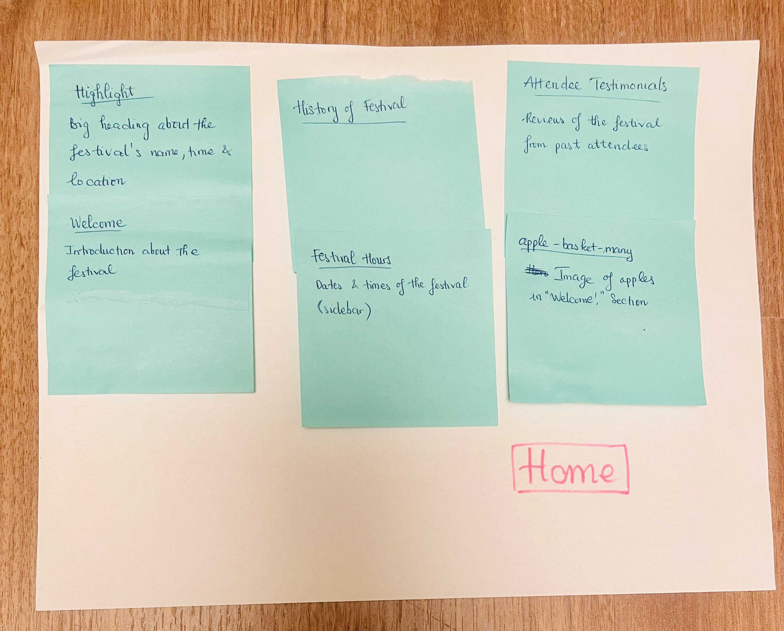
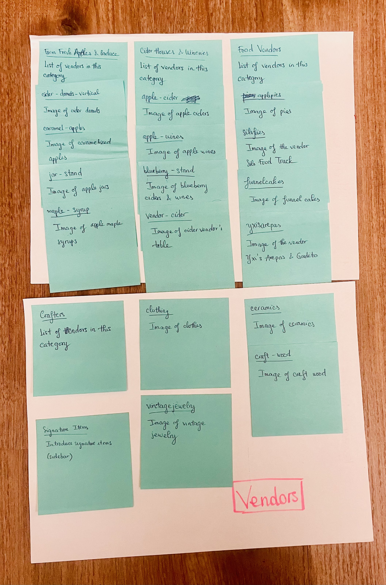
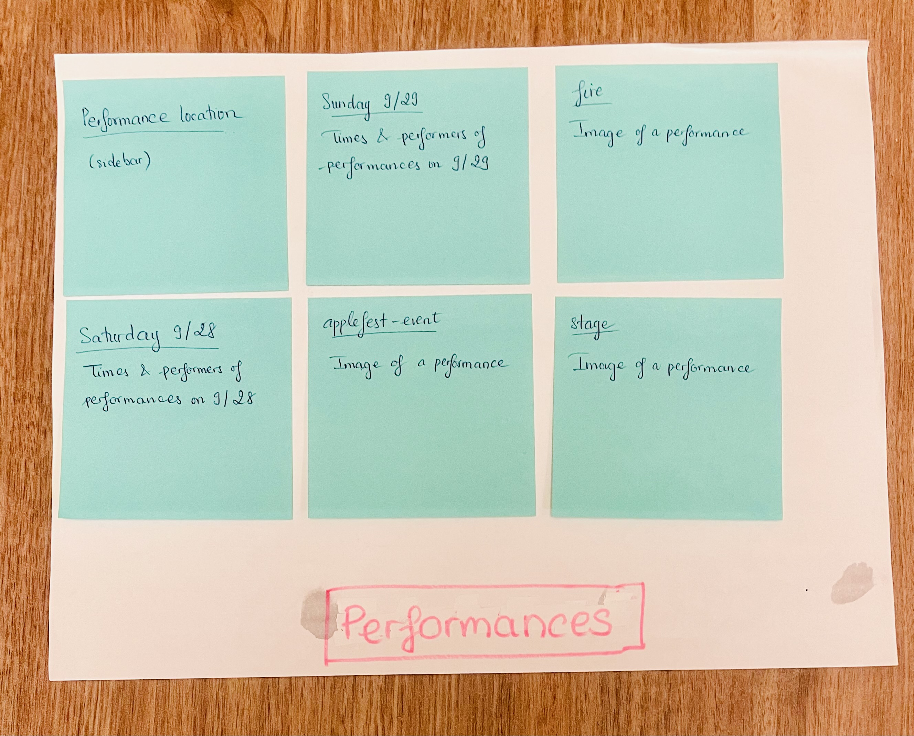
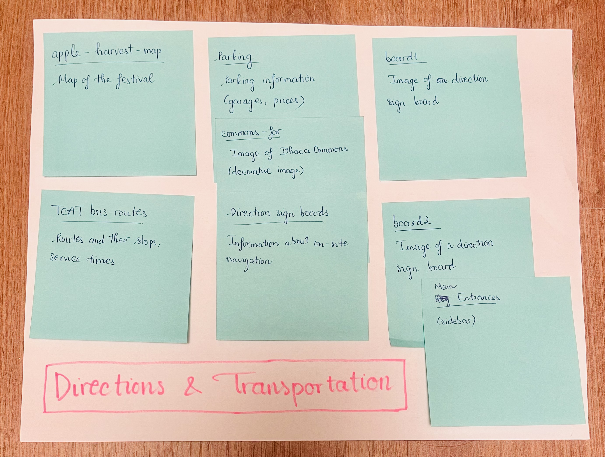
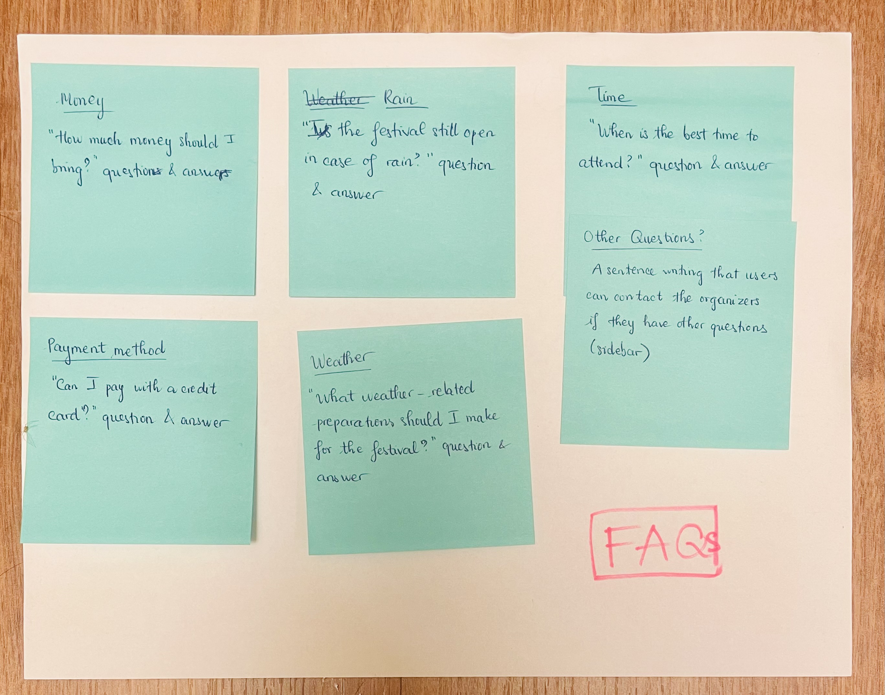
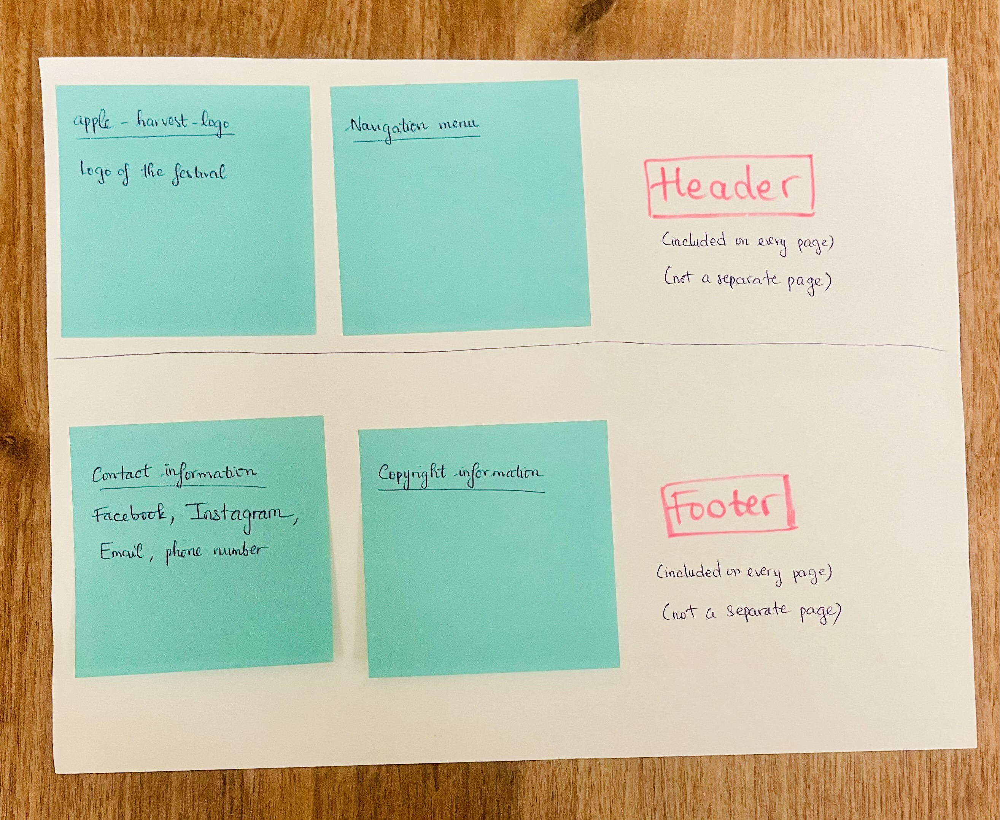

In this first iteration of card sorting, I divide the content into 7 groups: Home, Vendors, Performances, Directions & Transportation, FAQs, Header, and Footer.

- The "Home" page serves as an introduction of the fesival, featuring a welcoming message, key festival information and attendee testimonials so that the organizers can draw potential attendee's attention to the festival
- The "Vendors" page lets attendees know which products are must-try and different vendors are organized into their respective categories to showcase detailed information about vendors and their different types of products.
- The "Performances" page provides performance location and schedules and lets the audience know who are the performers.
- The "Directions & Transportation" page makes it easier for attendees to navigate transportation options and reduces their confusion while navigating on-site at the festival.
- The "FAQs" page answers common questions attendees may have to better help them prepare for the festival and recommends them to contact organizers if they have any other questions.
- "Header" and "Footer" groups are not pages but they're included on every page. "Header" includes a logo and a navigation menu to ensure brand consistency and consistent navigation. "Footer" provides contact and copyright information to ensure credibility and offer attendees a way to get in touch and follow the festival on social media.

**Card sorting 2**
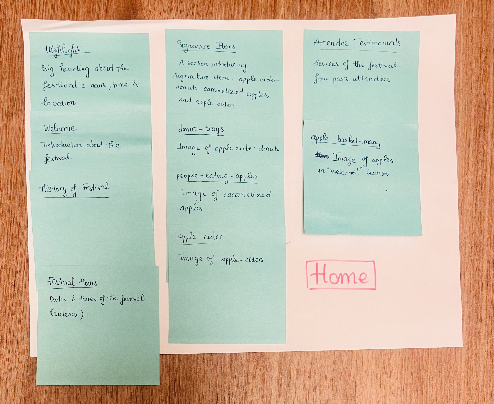

In this second iteration of card sorting, I also divide the content into 7 groups: Home, Vendors, Performances, Directions & Transportation, FAQs, Header, and Footer. Everything is the same as card sorting 1 except for the location of the signature item section. It is now also placed on the "Home" page along with their images. Since not all people will go to the "Vendors" page, doing so can more quickly showcase what makes the festival special to the audience and encourage them to explore the website further.

## Final Content Organization
> If you conducted more than one iteration of card sorting,
> which iteration of card sorting will you use for your website? (1 sentence)

I will use the second iteration for my website.

> Explain how the final organization of content is appropriate for your site's audiences. (1-2 sentences)

- This card sorting organization addresses the audience's goals by providing immediate access and easy navigation to key information they are seeking, whether it is vendor information, performance location & schedules, on-site navigation or transporation options.
- I decide to additionally highlight signature items along with their images right on the homepage to immediately draws users' attention to the festival's unique offerings, thus guiding them on how to explore the festival if they're unsure and making sure they won't miss these must-try products. Signature items were significant motivators for some participants in the interviews.
- Since my audience are Ithaca Area Residents, I don't include questions that people coming from other areas may have in the FAQs page but focus more on the potential factors that may affect the festival experience that the participants had reported. I don't create separate pages for these factors because they don't have much content and aren't the main parts of the festival.

## Navigation
> Please list the pages you will include in your website's navigation.

- Home
- Vendors
- Performances
- Directions & Transportation
- FAQs

> Explain why the names of these pages make sense for your site's audience. (1-2 sentences)

- Home: Since this page provides a welcoming introduction and quick access to essential information about the festival, naming it "Home" makes the page a starting point for all users.
- Vendors: Naming "Vendors" for this page is appropriate because it allows attendees to know that they're browsing through different types of vendors and their respective products.
- Performances: This name works well for the page giving information strictly on performance schedules and performers. It doesn't include information on other activities like workshops or games so I think "Performances" is more suitable than another name like "Entertainment."
- Directions & Transportation: This page provides information on both on-site navigation and transport options to get to the festival so this name covers both purposes.
- FAQs: Since this page anticipates common questions and offers related answers, naming it "FAQs" would be familiar for users to find this information if they have potential concerns. This name is also a common acronym for "Frequently Asked Questions" so I use it.

## Festival Example Website 1

<https://www.sdtet.com/>

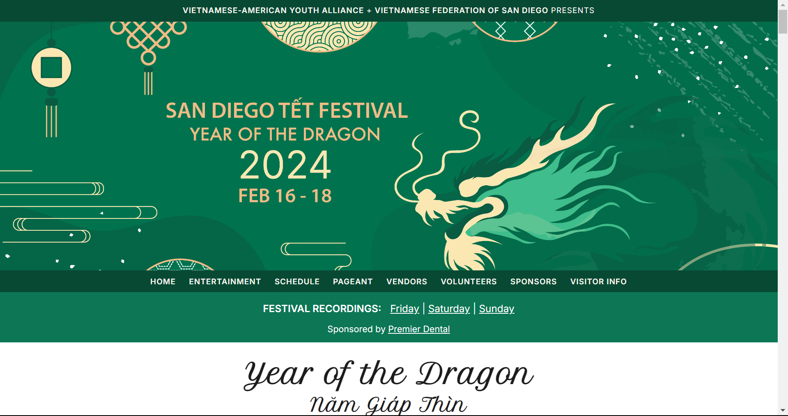

- What **goals** do you think the audience likely has when visiting this site.

The audience may want to know the dates, times, and locations of the festival, which is a multi-day celebration. They also seek details on specific activities like the pageant competition, performances, and cultural activities like lion dancing, the lucky red envelope ceremony, etc. Additionally, they want practical information about transportation, parking, and festival rules.

- What do you like about the design?

I like how the design separates different activities into different pages, which makes it easy for users to navigate to event details. The bright, celebratory imagery really evokes an inviting, energetic, festive atmosphere typical of Lunar New Year. They also help me visualize what the activities at the festival would look like. The font is pretty readable and the color palette is vibrant, which reinforce the event's lively atmosphere and bring an Asian vibe.

## Festival Example Website 2

<https://wineandchocolatefestivals.com/events/syracuse/>

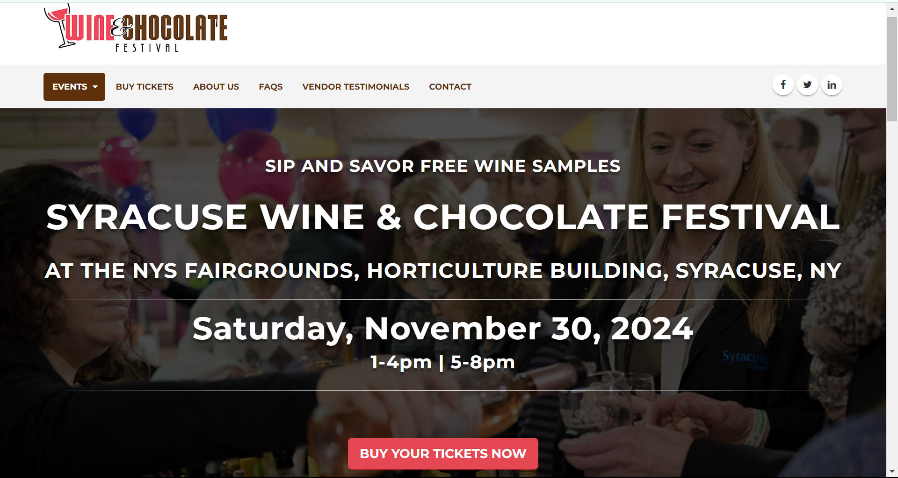

- What **goals** do you think the audience likely has when visiting this site.

The audience likely aim to find event details, such as the dates, times, and locations, while also looking for ticket purchase options. They also want information on the wine, chocolate, craft vendors and other vendors present, along with details about hotel options and logistical aspects like parking or transportation. Vendors who are interested in selling their products also pay attention to the registration forms.

- What do you like about the design?

In addition to the navigation menu at the top of the page, the website has a sidebar menu that users can use to navigate different sections without going to another page. Its choice of headings and fonts make the website looks pretty clean and well-organized. I also love how the designers use the color red and brown to indirectly remind users that the festival is about wine and chocolate.

## Entire Website's "Laptop" Design
> Plan the design of the website for laptop devices.
> Include a sketch for each page of your website.
> Label each sketch, so that we understand what page we are reviewing. (1 short phrase per sketch)

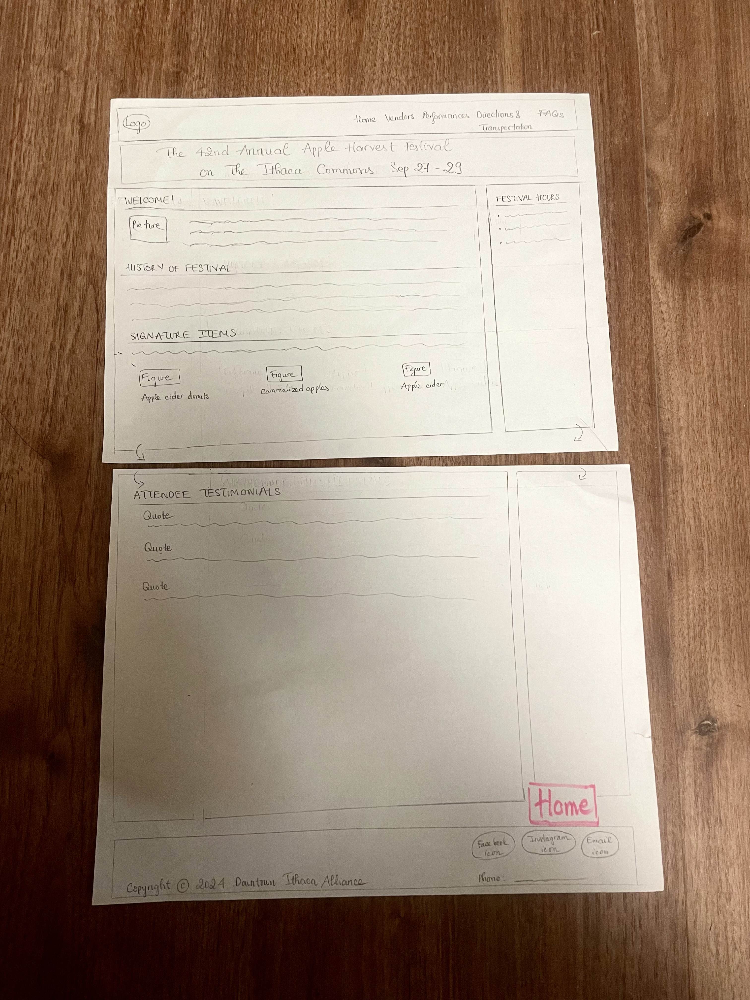
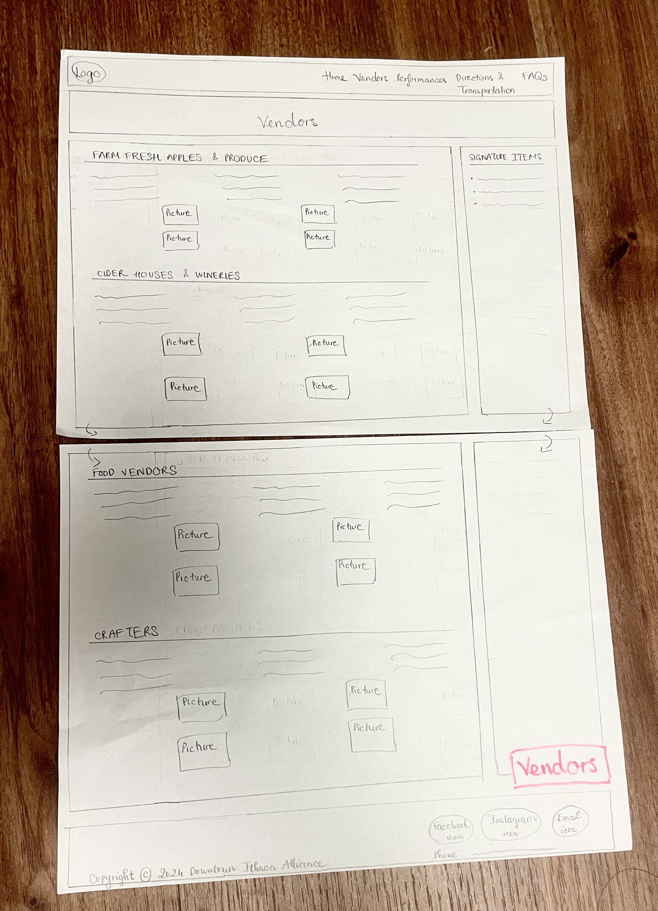
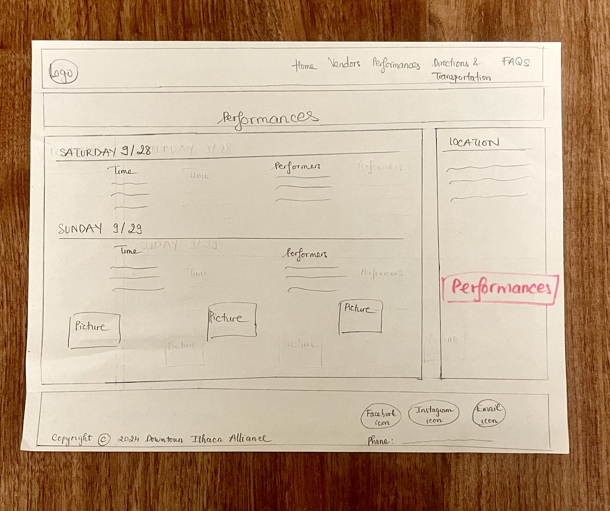
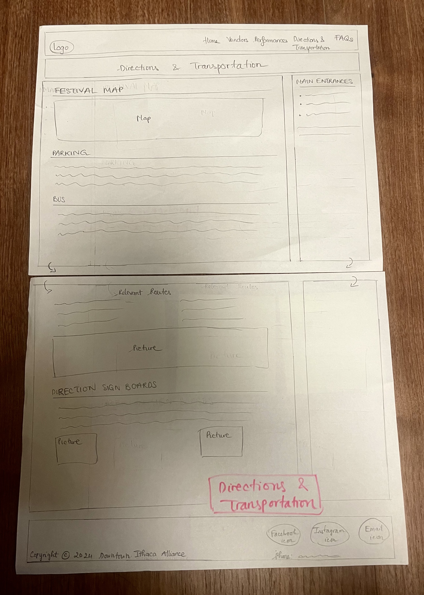
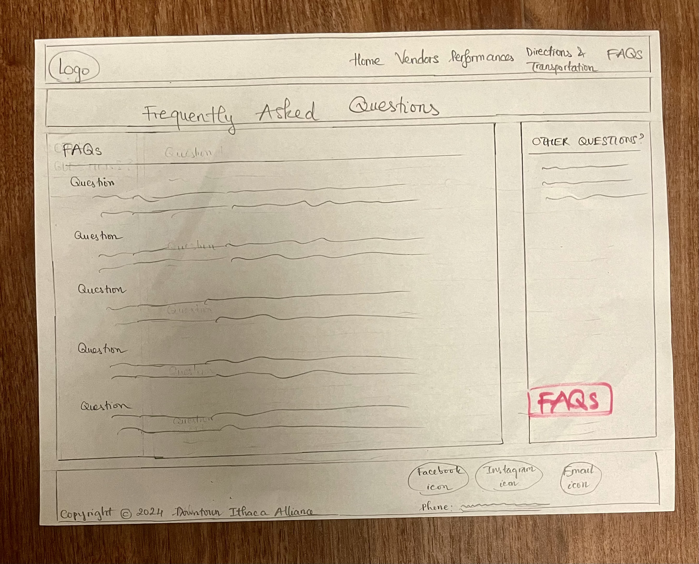

(The pink boxes are the names of the pages; they aren't included in the page)

## Design Rationale
> Explain why your design is appropriate for your audience.
> Specially, why does your content organization, navigation, and site design/layout meet the goals of your users?
> How did you employ familiarity to improve the usability of the site for your audience? (2-4 sentences)

- My navigation bar leads to 5 pages as I outlined before.
- The logo is at the top left corner, the name of the each current page is central-aligned at the top of the page, and the headings have a thin border below them to draw users' attention to main sections and align with the design of many festival websites.
- I put "Festival Hours," "Signature Items," "Performance Location," "Main Entrances," and "Other Questions" in the sidebar on their respective page because doing so can help align with the audience's goals of easily finding essential festival details, must-try features, performance spots, navigation points, and answers to more concerns. Some participants expressed their difficulties in accessing these types of information or thought they are important so I put them on the sidebar to improve their visibility to the audience. Although there were some difficulties in accessing the bus routes, Ithaca Area Residents often already know about TCAT and the information about it is too much so I include it in the main content, not on the sidebar. The sidebar is aligned to the right to suit users' scanning patterns and follow the convention of placing essential, frequently accessed information on the right sidebar of many websites.
- I also divide vendor, performance, route lists and some images into columns so that the overall pages look less stacked as many websites do on wide screen.
- Additionally, I include images in every page except for the FAQs page to help the audience visualize different aspects of the festival (there's no image in the FAQs page because I want to mainly focus on the questions and answers). I also write the full word "Frequently Asked Questions" in the heading in case someone doesn't know the acronym.

## References

### Collaborators
> List any persons you collaborated with on this project.

### Reference Resources
> Did you use any resources not provided by this class to help you complete this assignment?
> List any external resources you referenced in the creation of your project. (i.e. W3Schools, StackOverflow, Mozilla, etc.)
>
> List **all** resources you used (websites, articles, books, etc.), including generative AI.
> Provide the URL to the resources you used and include a short description of how you used each resource.

I used this website for information on bus routes:
<https://tcatbus.com/bus-schedules>

I used Canva to create some of my images.

[← Table of Contents](design-journey.md)
