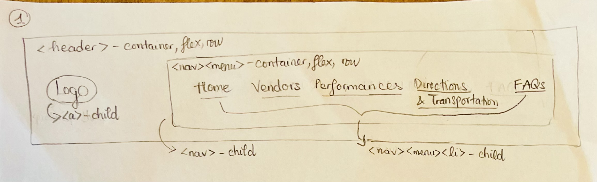
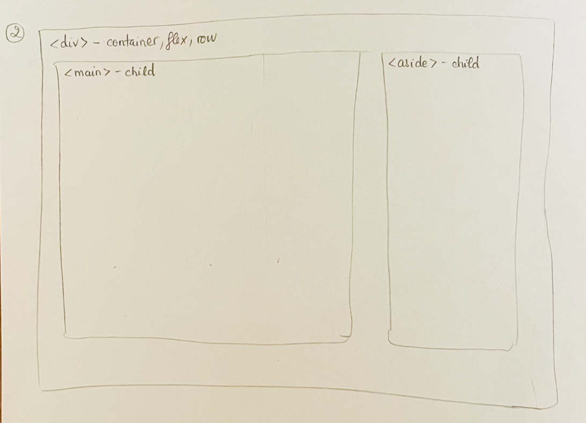

# Project 2, Milestone 2: Design Journey

[← Table of Contents](design-journey.md)

> **Replace ALL _TODOs_ with your work.** (There should be no TODOs in the final submission.)
>
> Be clear and concise in your writing. Bullets points are encouraged.
>
> Place all design journey images inside the "design-plan" folder and then link them in Markdown so that they are visible in Markdown Preview.
>
> **Everything, including images, must be visible in _Markdown: Open Preview_.** If it's not visible in the Markdown preview, then we can't grade it. We also can't give you partial credit either. **Please make sure your design journey should is easy to read for the grader;** in Markdown preview the question _and_ answer should have a blank line between them.

## Milestone 1 Feedback Revisions
> Explain what you revised in response to the Milestone 1 feedback (1-2 sentences)
> If you didn't make any revisions, explain why.

I didn't make any revisions because I didn't get my points deducted in the last milestone.

## Flexbox Planning Sketches
> Create two **planning** sketches to plan the flexboxes for the navigation bar and sidebar.

## References

### Collaborators
> List any persons you collaborated with on this project.

### Reference Resources
> Did you use any resources not provided by this class to help you complete this assignment?
> List any external resources you referenced in the creation of your project. (i.e. W3Schools, StackOverflow, Mozilla, etc.)
>
> List **all** resources you used (websites, articles, books, etc.), including generative AI.
> Provide the URL to the resources you used and include a short description of how you used each resource.

I used this website for information on bus routes:
<https://tcatbus.com/bus-schedules>

I used Canva to create some of my images.

[← Table of Contents](design-journey.md)
