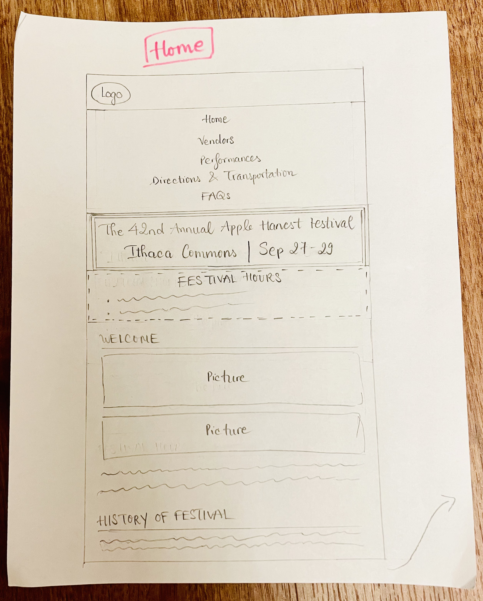
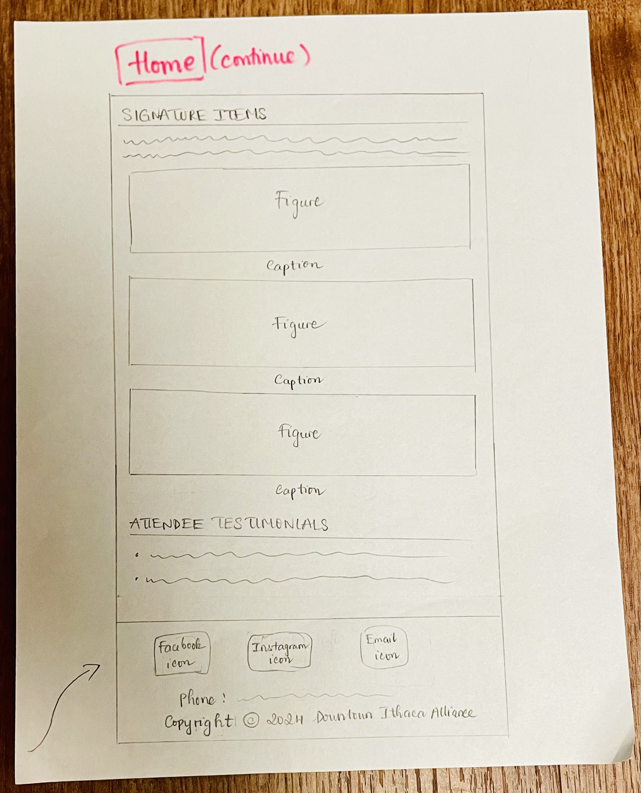
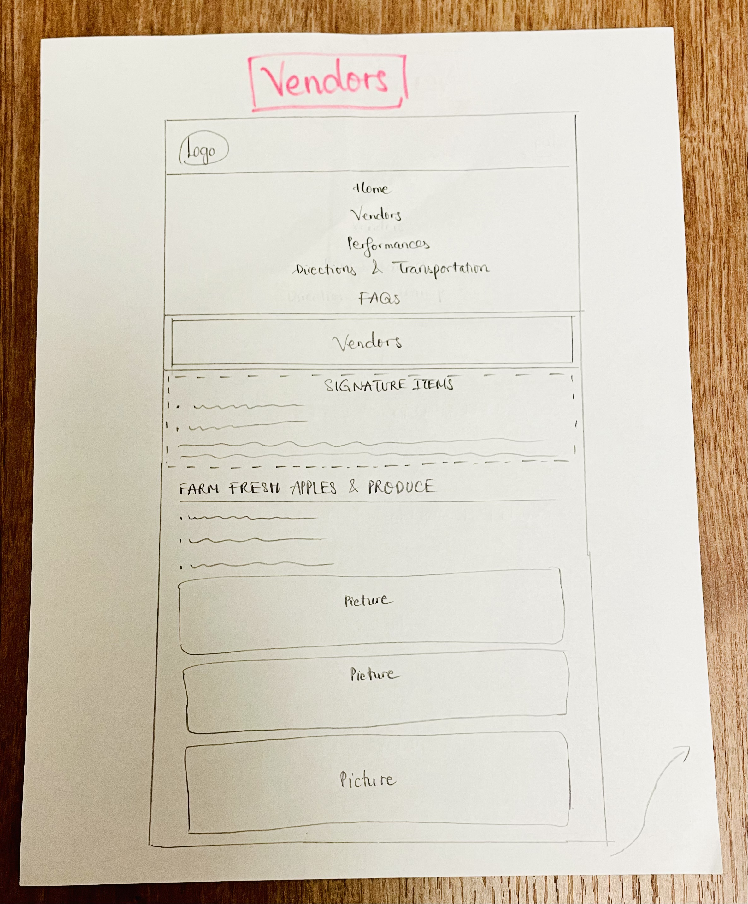
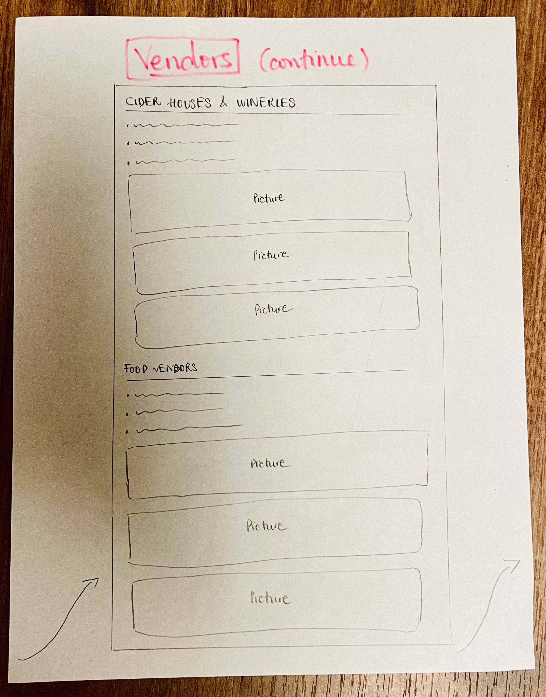
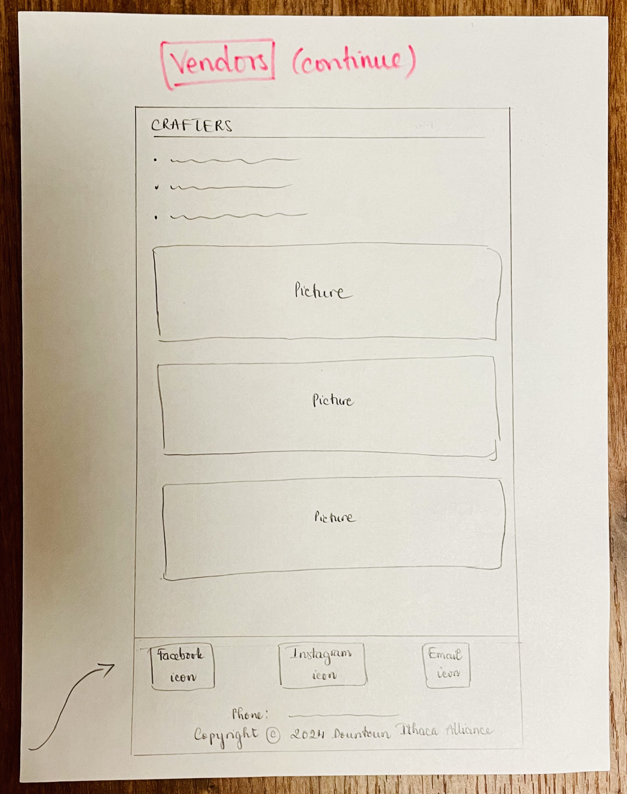
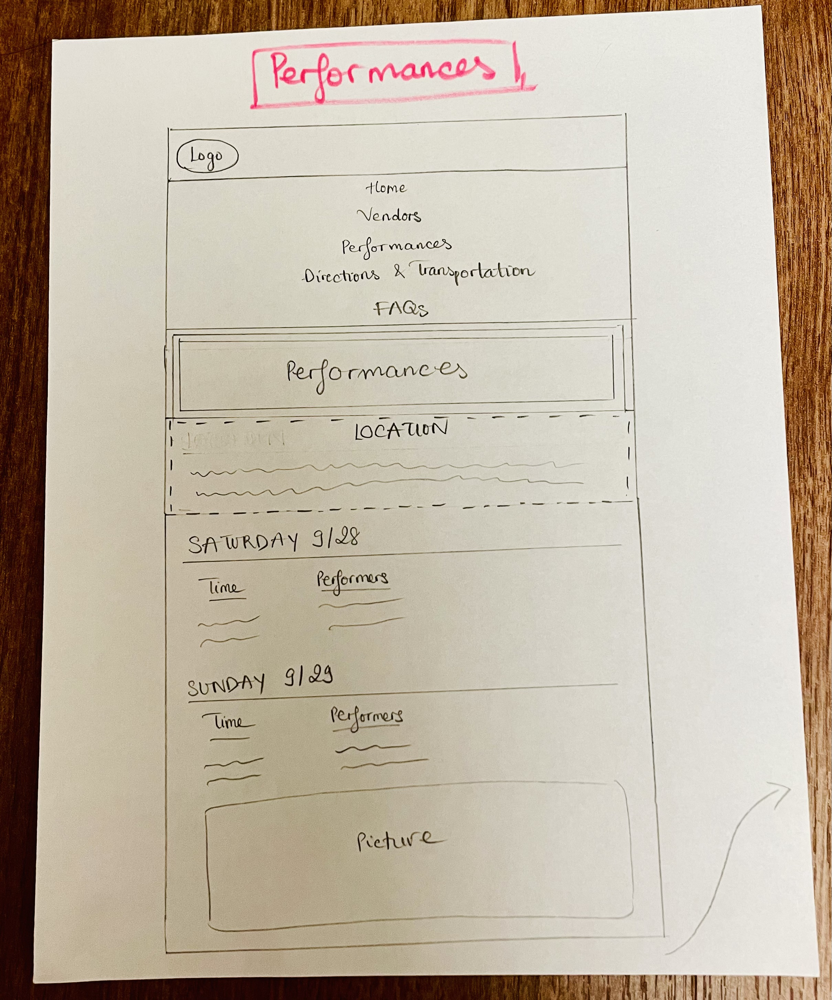
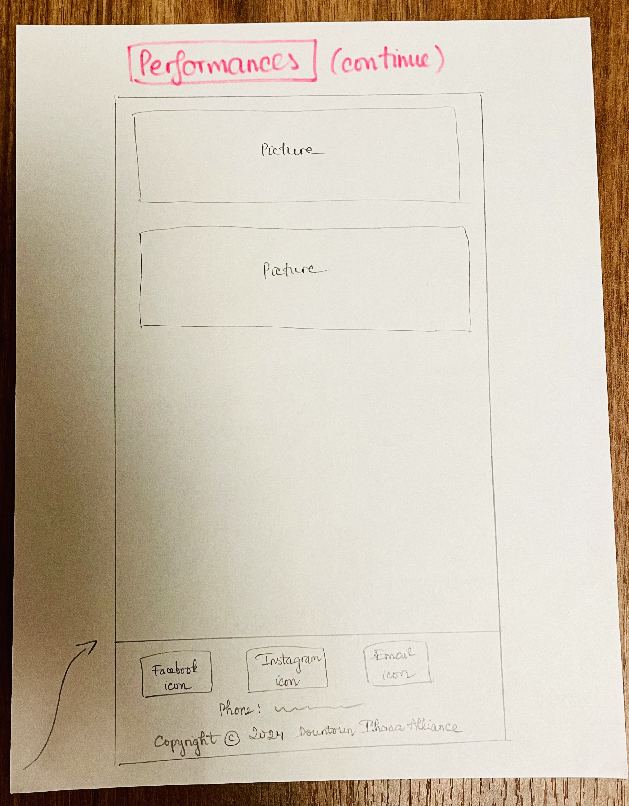
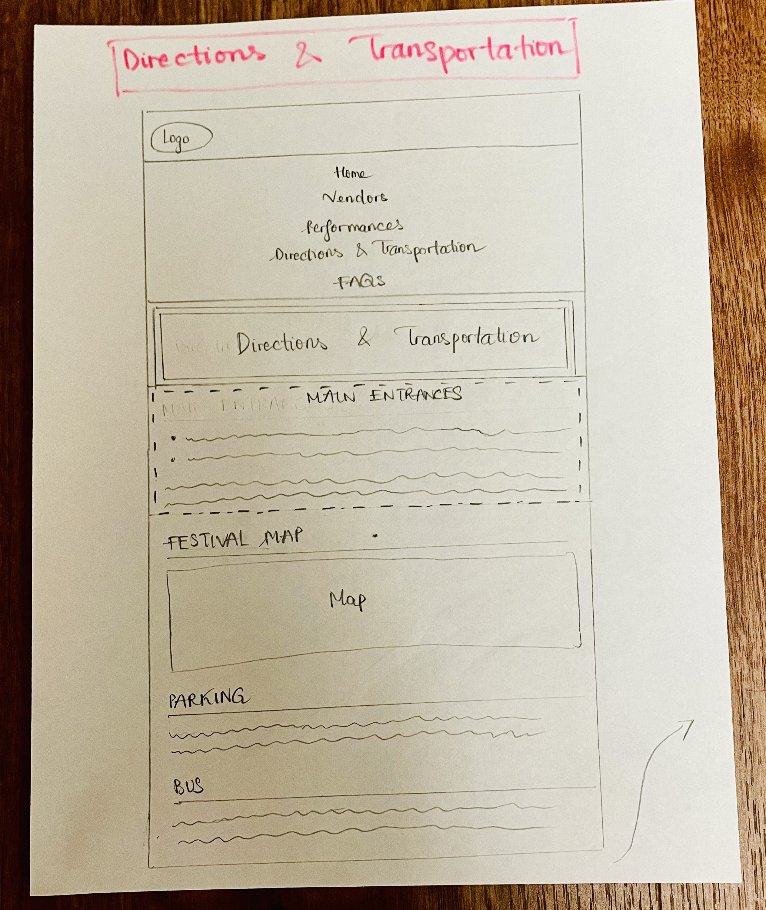
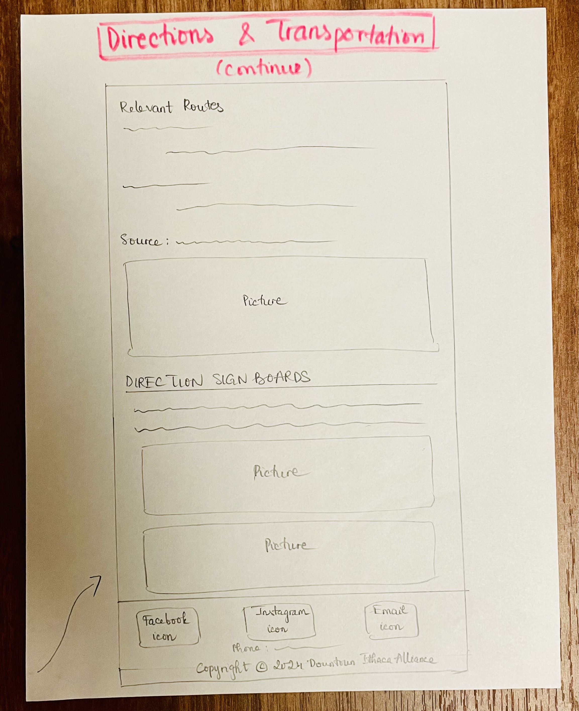
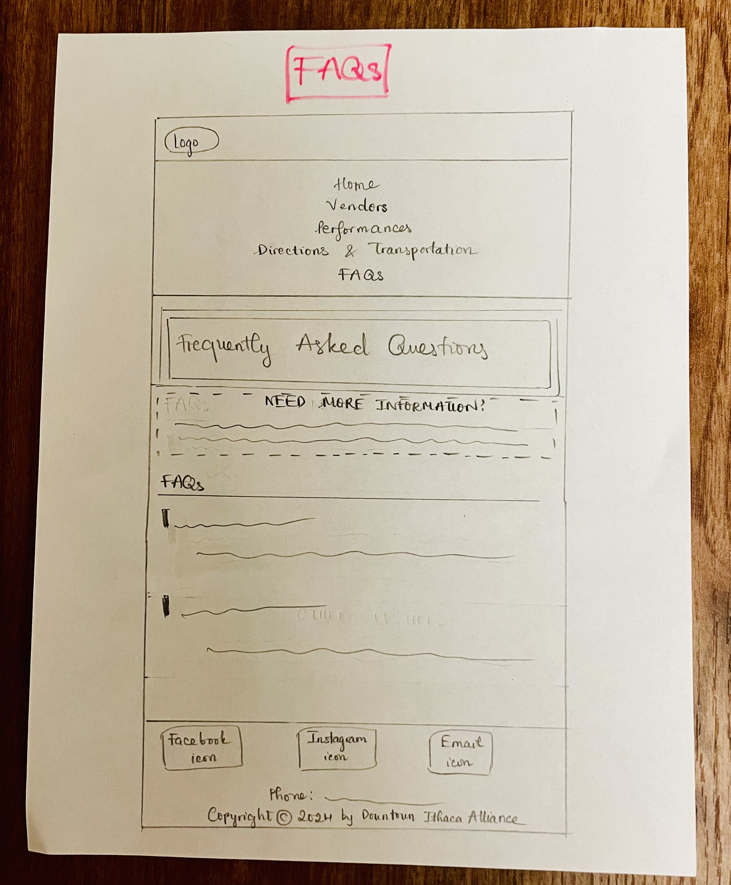

# Project 2, Final Submission: Design Journey

## Milestone 2 Revisions

- I added one image to the "Welcome" section on the "Home" page to fill the empty space to the left of the text.
- I deleted one image per section on the "Vendors" page so that I can style them to all be in the audience's eyesight right away. It will work better for my narrow screen design as well because users won't have to scroll a lot.
- I changed some of the images because they would be more aesthetically consistent.

## Entire Website's Narrow Design

I put the sidebar on the top of the main content in narrow screen because I want to highlight the content in the sidebar. Putting it at that position makes more sense for the reading flow of the users.

## Self-Reflection

During this assignment, the most important thing I've learned is designing with fluid responsiveness in mind. To do that, I need to resize/scale images and use CSS media queries to ensure a seamless user experience across various screen sizes. Compared to Project 1, I now remember that images should fill 100% of the content width for narrow screens. I also learned to conduct user interviews and design my website to better align with my audience's goals.

I've considerably improved my skill using the inspector element, which really has helped me with margin/padding and debugging. I feel that I'm more confident with content structuring and more skillful with applying the visual principles to designing. Additionally, I really struggled with using flexbox but now I'm much more confident about it! Although it took me a really long time to design my website, I'm glad I enhanced my patience and problem-solving skills to deliver a polished and user-friendly website.

## References

I used this website for information on bus routes:
<https://tcatbus.com/bus-schedules>

I used Canva to create some of my images.

[← Table of Contents](design-journey.md)
