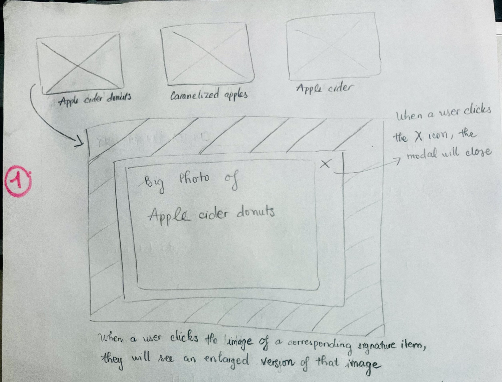
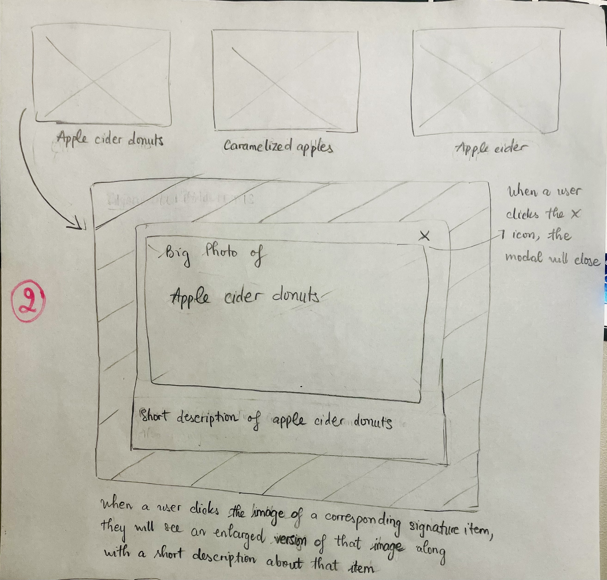
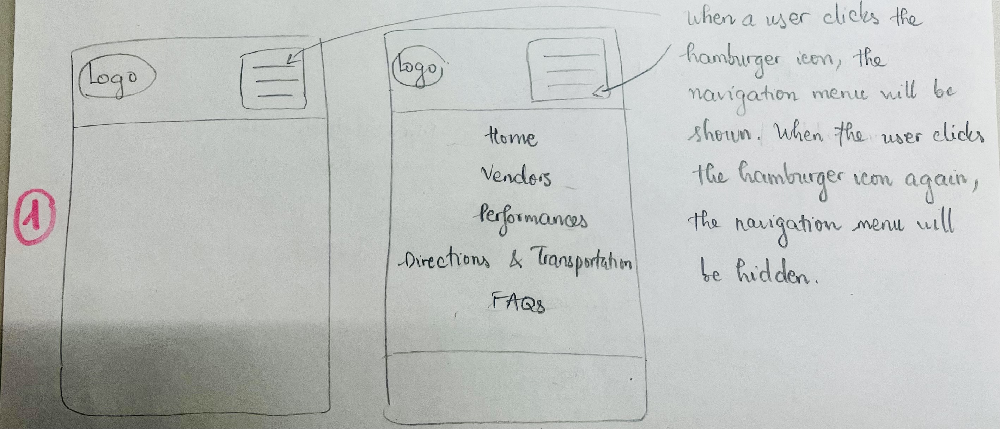
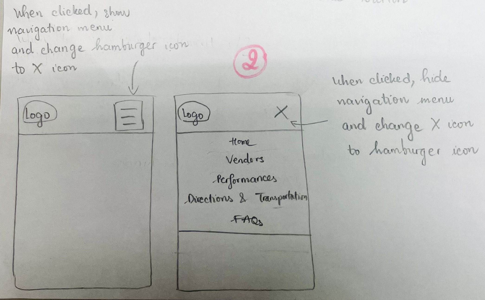
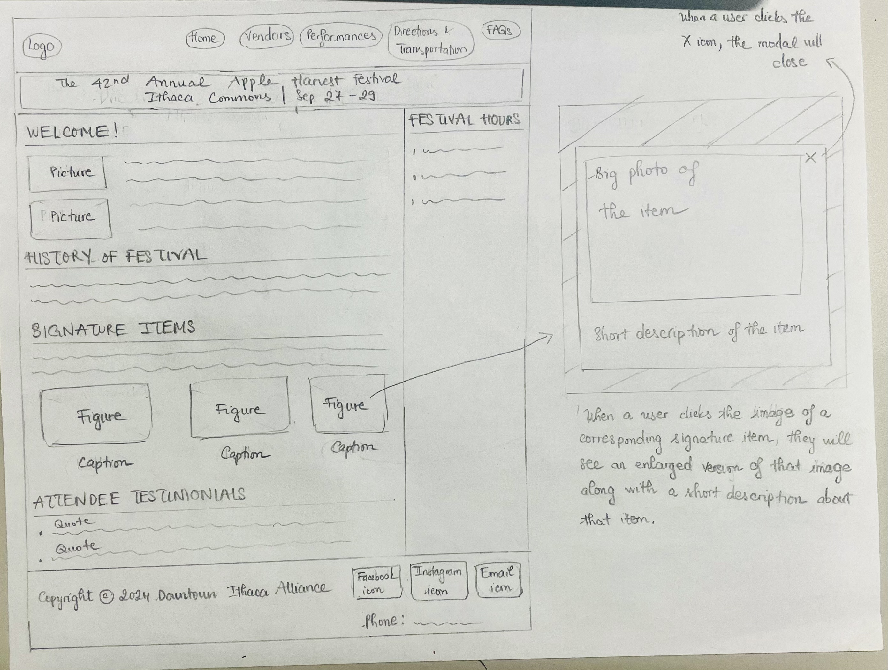
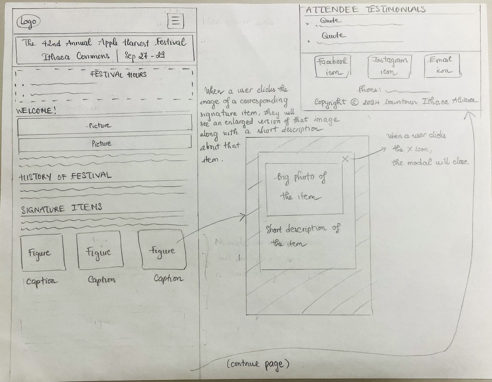
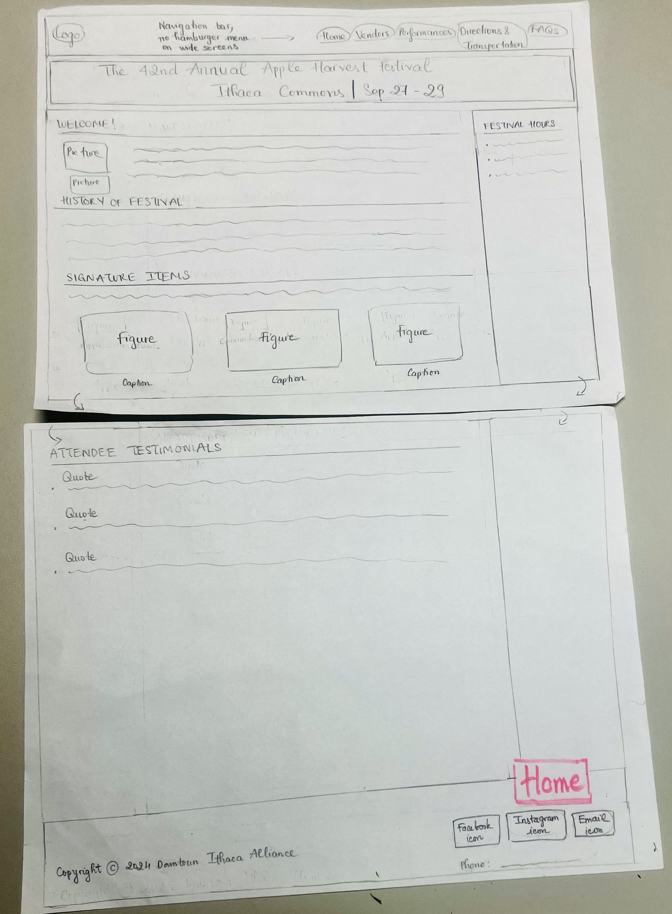
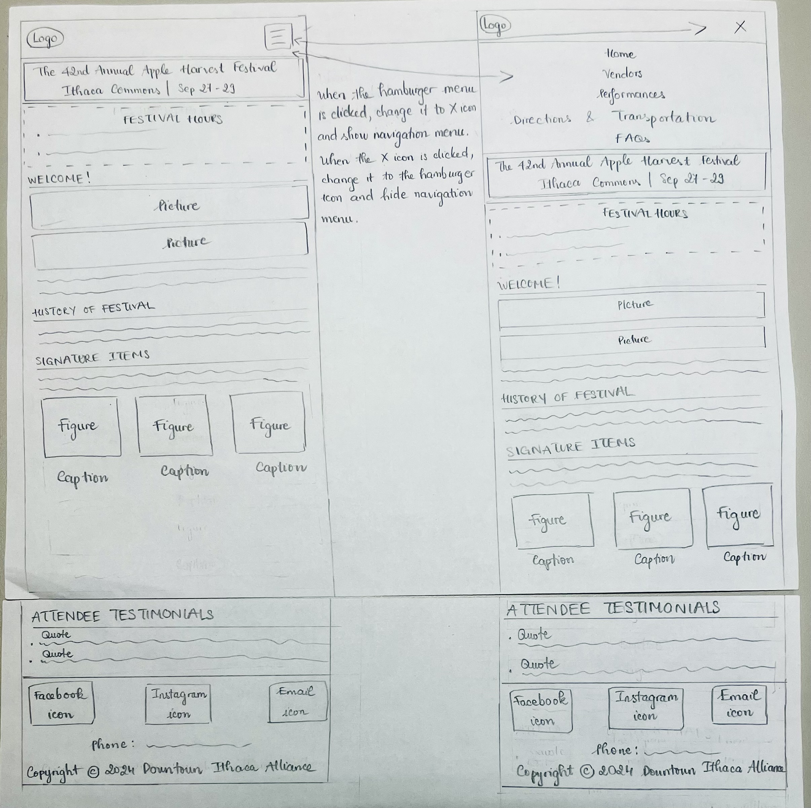
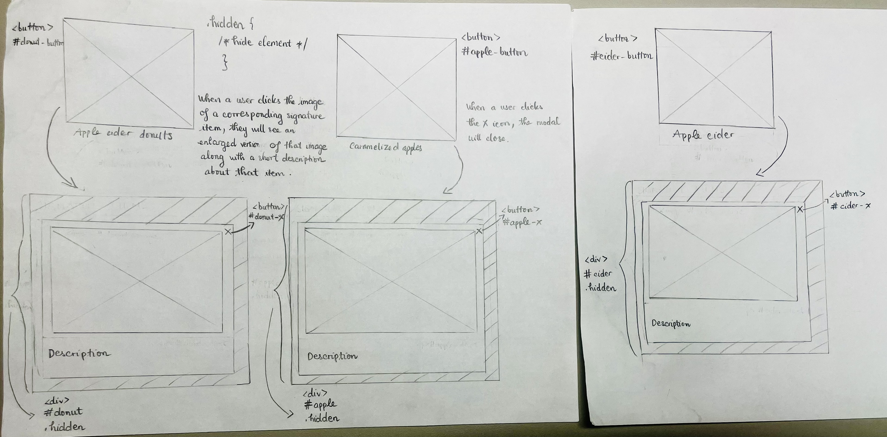
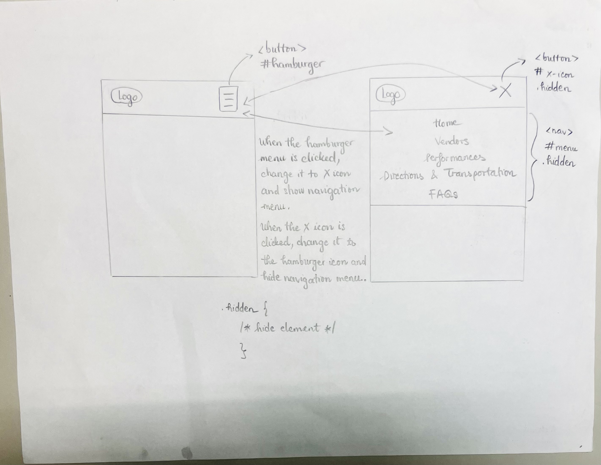

# Project 3, Milestone 1: Design Journey

[← Table of Contents](design-journey.md)


> **Replace ALL _TODOs_ with your work.** (There should be no TODOs in the final submission.)
>
> Be clear and concise in your writing. Bullets points are encouraged.
>
> Place all design journey images inside the "design-plan" folder and then link them in Markdown so that they are visible in Markdown Preview.
>
> **Everything, including images, must be visible in _Markdown: Open Preview_.** If it's not visible in the Markdown preview, then we can't grade it. We also can't give you partial credit either. **Please make sure your design journey should is easy to read for the grader;** in Markdown preview the question _and_ answer should have a blank line between them.


## Project
> Which project will you add interactivity to enhance the site's functionality?

I will add interactivity to Project 2.

## Audience's Goals
> List the audience's goals that you identified in Project 1 or 2.
> Simply list each goal. No need to include the "Design Ideas and Choices", etc.
> You may adjust the goals if necessary.

1. Finding and accessing information easily as the audience sought out information (online maps, date & time information, physical signage) before and during the festival
2. Knowing how they should prepare for or handle potential challenges at the festival
3. Knowing information about specific vendors & performances (more transparency about available options, locations, schedules)
4. Exploring signature items or highly recommended foods
5. Accessing clear, easy-to-find information on transportation and on-site navigation


## Modal Interactivity Brainstorm
> Using the audience goals you identified, brainstorm possible options for **modal** interactivity to enhance the functionality of the site while also assisting the audience with their goals.
> Briefly explain each idea and provide a brief rationale for how the interactivity enhances the site's functionality for the audience. (1 sentence)
> Note: You may find it easier to sketch for brainstorming. That's fine too. Do whatever you need to do to explore your ideas.

- A modal that opens an enlarged version of each image along with a short description in the signature items section to allow users to view the images more closely, enhancing their connection to the festival's atmosphere and must-try items before exploring food options
- Modals that organize images of each vendor section into a gallery to allow users to visually explore more abundant offerings in each vendor category, making it easier to discover and plan visits to certain vendor types
- A modal that opens an enlarged version of the TCAT fare website screenshot on the "Directions & Transportation" page to help users visualize beforehand information on bus fares after they click on the link to that website
- A modal that opens an enlarged version of each of the bus route image to help users closely view the images of the routes relevant to them without needing to go to the TCAT website


## Interactivity Design Ideation
> Explore the possible design solutions for the interactivity.
> Sketch at least two iterations of the modal and at least two iterations of the hamburger menu interactivity.
> Annotate each sketch explaining what happens when a user takes an action. (e.g. When user clicks this, something else appears.)
> Do not include HTML/CSS annotations in your sketches!







## Final Interactivity Design Sketches
> Create _polished_ design sketch(es) (it's still a sketch, but with a little more care taken to communicate ideas clearly to the graders) to plan your interactivity.
> **Sketch out the entire page where your interactivity will go.**
> Include your interactivity to the sketch(es).
> Add annotations to explain what happens when the user takes an action.
> Include as many sketches as necessary to communicate your design (ask yourself, could another 1300 take these sketches an implement my design?)

**Modal design sketches:**




**Hamburger drop-down navigation menu design sketches:**





## Interactivity Rationale
> Describe the purpose of your proposed interactivity.
> Provide a brief rationale explaining how your proposed interactivity addresses the goals of your site's audience.
> This should be about a paragraph. (2-3 sentences)

A hamburger menu is used to save screen space by keeping navigation options hidden until needed, allowing users to focus immediately on the essential information of the page that they come to find such as vendor offerings, performance schedules, transportation information, etc. A modal serves to enhance users' viewing experience by allowing them to clearly see enlarged images of signature food items. It helps them better connect with the festival's unique culinary offerings, providing users a sense of excitement before they explore food options on-site. The short description under the image in the modal also adds context to the signature item to help attendees feel informed, making it easier to imagine what the item is like and subsequently plan their food choices at the festival.


## Interactivity Planning Sketches
> Produce planning sketches that include all the details another 1300 student would need to implement your interactivity design.
> Your planning sketches should include _all_ HTML elements needed for the interactivity; _annotations_ for the element types, their unique IDs, and CSS classes; and lastly the initial CSS classes.
> This is asking you to create a planning sketch like the one we did during the in-class activity.

**Modal planning sketches:**



**Hamburger drop-down navigation menu planning sketches:**




## Interactivity Pseudocode Plan
> Write your interactivity pseudocode plan here.
> Pseudocode is not JavaScript. Do not put JavaScript code here.

**Modal pseudocode:**

> Pseudocode to open the modal:

```
when #donut-button is clicked (event):
  remove .hidden from #donut
when #apple-button is clicked (event):
  remove .hidden from #apple
when #cider-button is clicked (event):
  remove .hidden from #cider
```

> Pseudocode to close the modal:

```
when #donut-x is clicked (event):
  add .hidden to #donut
when #apple-x is clicked (event):
  add .hidden to #apple
when #cider-x is clicked (event):
  add .hidden to #cider
```

**Hamburger menu pseudocode:**

> Pseudocode to show/hide (toggle) the navigation menu (narrow screens) when the hamburger button is clicked:

```
when #hamburger is clicked:
  if the navigation menu is not visible:
    remove .hidden from #menu
    add .hidden to #hamburger
    remove .hidden from #x-icon
  else:
    add .hidden to #menu
    add .hidden to #x-icon
    remove .hidden from #hamburger

when #x-icon is clicked:
  if the navigation menu is visible:
    add .hidden to #menu
    add .hidden to #x-icon
    remove .hidden from #hamburger
  else:
    remove .hidden from #menu
    remove .hidden from #x-icon
    add .hidden to #hamburger
```

> Media queries are prohibited to show/hide the hamburger menu for this assignment.
> (I want you to demonstrate the interactivity learning objectives we covered in class.)
> If the browser window is narrow when the page loads, the hamburger button should be visible and the navigation should be hidden.
> If the browser window is wide when the page loads, the hamburger menu should not be visible.
> Complete the pseudocode to show/hide (toggle) the navigation on page load:

```
on page load (ready):
  if window is narrow:
    remove .hidden from #hamburger
    add .hidden to #menu
  else if window is wide:
    add .hidden to #hamburger
    remove .hidden from #menu

```

> If the browser window is resized from wide to narrow, the hamburger menu should become visible and the navigation should be hidden.
> If the browser window is resized from narrow to wide, the hamburger menu should become hidden and the navigation should be visible.

```
on window resize:
  if window is narrow:
    remove .hidden from #hamburger
    add .hidden to #menu
  else if window is wide:
    add .hidden to #hamburger
    remove .hidden from #menu
```

## Notes

- Currently, there is a hamburger menu on my wide screen and a navigation menu on my narrow screen because the instruction said "show the hamburger button and navigation when the page loads" (we haven't used JavaScript in this milestone).
- I have a grid of thumbnails laid out side-by-side for signature item images in narrow screens because I saw the professor did a similar thing in the in-class activity. It also makes more sense to style them small that way because then the modals would open up enlarged versions of the images.

## References

### Collaborators
> List any persons you collaborated with on this project.


### Reference Resources
> Did you use any resources not provided by this class to help you complete this assignment?
> List any external resources you referenced in the creation of your project. (i.e. W3Schools, StackOverflow, Mozilla, etc.)
>
> List **all** resources you used (websites, articles, books, etc.), including generative AI.
> Provide the URL to the resources you used and include a short description of how you used each resource.

I used this website for information on bus routes: <https://tcatbus.com/bus-schedules>.

I used Canva to create some of my images.

[← Table of Contents](design-journey.md)
